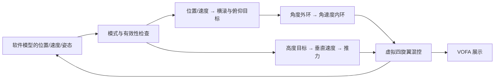

# 教学工程结构

```text
src/hal/                    板级 GPIO/UART/I2C/TIM/传感器驱动
src/flight/                 HAL 无关的命令解析、门控、PID、悬停状态机
src/demo/demo_vofa/          第 1 课，真实板载传感器
src/demo/demo02_remote/      第 2 课，USART1 接收 + UART4 日志
src/demo/demo03_motor/       第 3 课，默认演示/可选单路拆桨台架
src/demo/demo04_hover_logic/ 第 4 课，纯软件飞行模型
tests/test_flight.c          主机边界、失效处理与模型周期检查
src/sensors/                可注入寄存器IO的ToF/光流驱动、F22总线适配
src/demo/demo05_tof/         第5课，实际测距
src/demo/demo06_flow/        第6课，实际像素增量与质量
src/demo/demo07_integration/ 第7课，实际传感器与控制器预览
remote/tle100/              AT89S52发射端，独立SDCC构建
tests/test_sensors.c         替身传输错误、超时与观测数学
scripts/check_demos.sh      主机检查 + 九个F22教学构建
```

`platformio.ini` 的每个教学环境只选自己的 main 和所需算法文件。第一课环境 `demo01_vofa` 复用 `demo_vofa`，保持已有通道次序。

悬停模型的数据路径：



第4课由理想模型设置有效位；第7课由真实适配层与标定状态设置有效位，仍不连接电机驱动。ToF的时间戳/原始状态和光流质量单独检查。第2课新Radio协议提供心跳，整合课目前用本地按键，尚未把无线命令接到任务层。

姿态/混控演示使用机体 X 前、Y 右、Z 下，高度和垂直速度向上为正；水平位置/速度在起始局部坐标系中。虚拟电机为前左、前右、后右、后左，偏航系数只是示例，尚未映射到 M 口。

姿态估计的输入是FRD机体比力，静止平放accZ=-1g；取负得到重力方向修正四元数。第1课保留旧传感器坐标显示，不能直接把旧通道当FRD机体轴。估计器比例与矩阵在第7课config.h；未标定默认拒绝有效位置/飞行预览启动。
